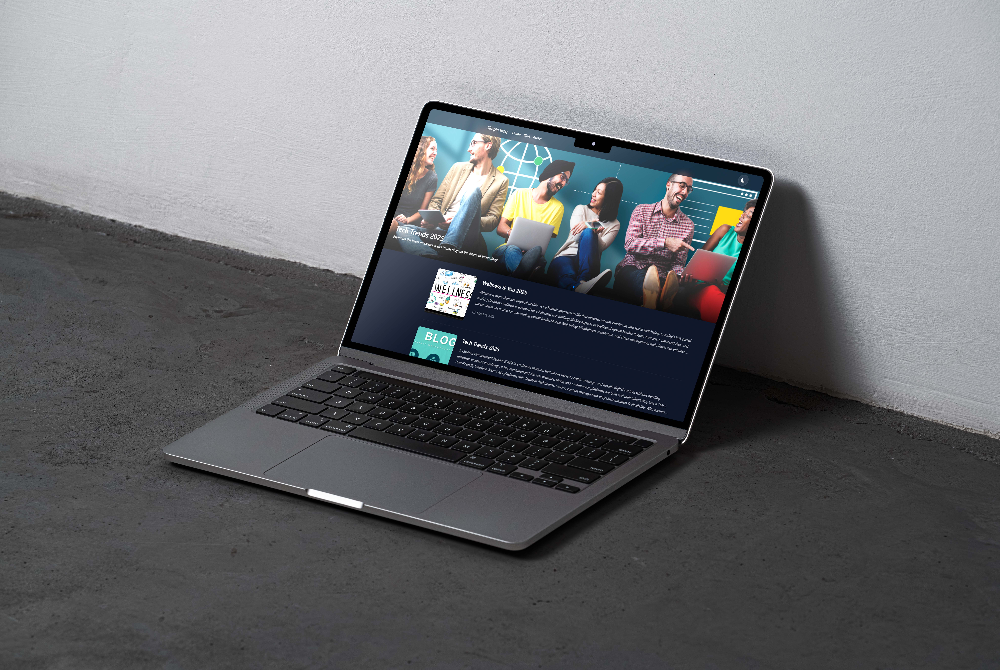

# QuickCMS - PHP Blog System



> 🌐 [Live Demo](https://i.ibb.co.com/qLMncxYD/Macbook-Pro-Showcase-Screen-Free-psd-Mockup.jpg) - See it in action!

A lightweight and customizable PHP-based blog system with a powerful admin panel.

## Features

- 🚀 Modern and responsive blog interface
- 👨‍💼 Secure admin panel
- 📝 Create, edit, and manage blog posts
- 🖼️ Carousel/slider management
- 📊 Statistics and visitor tracking
- ⚙️ System settings customization
- 🔐 User authentication system

## Requirements

- PHP 7.4 or higher
- MySQL/MariaDB
- Web server (Apache/Nginx)
- Composer (PHP package manager)

## Installation

1. Clone the repository:
```bash
git clone https://github.com/1dev-hridoy/QuickCMS.git
cd QuickCMS
```

2. Install dependencies:
```bash
composer install
```

3. Configure your web server:
   - Point your web server's document root to the project directory
   - Ensure the `uploads` directory has write permissions
   - Configure your PHP settings (recommended memory_limit: 128M)

4. Database Setup:
   - Create a new MySQL database
   - Import the database schema (located in `server/database.sql`)
   - Update database credentials in the configuration file

## Directory Structure

```
QuickCMS/
├── admin/           # Admin panel files
├── assets/         # CSS, JS, and media files
├── includes/       # Core PHP includes
├── server/         # Server configurations
├── uploads/        # User uploaded content
└── vendor/         # Composer dependencies
```

## Customization

### Theme Customization
- Modify CSS files in `assets/css/`
- Update template files in `includes/`
- Customize admin panel look in `admin/assets/css/`

### Adding New Features
1. Create new PHP files in appropriate directories
2. Update includes/header.php for navigation
3. Add new admin panel options in admin/settings.php

### Configuration Options
- System settings can be modified through the admin panel
- Core configurations are in the server configuration files

## Admin Panel

Access the admin panel by navigating to:
```
http://your-domain.com/admin/
```

Default admin credentials should be set during installation.

### Admin Features
- Dashboard with statistics
- Post management
- Media management
- Carousel/slider control
- System settings
- User management

## Security

- Keep your PHP version updated
- Regularly backup your database
- Use strong passwords
- Keep admin credentials secure
- Regularly update dependencies

## Contributing

1. Fork the repository
2. Create your feature branch
3. Commit your changes
4. Push to the branch
5. Create a new Pull Request

## License

This project is licensed under the MIT License - see the LICENSE file for details.

## Support

For support, please open an issue in the GitHub repository or contact the maintainers.

---
Made with ❤️ by Hridoy
